# LexusNexus Platform Architecture & SRE Operating Model

This document provides a detailed architectural view of the LexusNexus platform landscape, the function of each platform domain, and how Site Reliability Engineering (SRE) teams are positioned to ensure reliability, scalability, and observability.

Interview preparation companion: [`interview-prep-principal-sre.md`](./interview-prep-principal-sre.md)
AI opportunities companion: [`ai-sre-opportunities.md`](./ai-sre-opportunities.md)

> Assumption: This is a reference architecture based on standard enterprise-scale platform patterns and the tooling baseline in `tools.md`.

## 1) High-Level Architecture Diagram

```mermaid
flowchart TB
    %% Users & Channels
    U1[Retail Customers]
    U2[Enterprise Clients]
    U3[Internal Operations]

    C1[Web Portal]
    C2[Mobile Apps]
    C3[Partner/API Clients]

    U1 --> C1
    U1 --> C2
    U2 --> C3
    U3 --> C1

    %% Edge Layer
    E1[CDN/WAF]
    E2[API Gateway]
    E3[Identity & Access Platform]

    C1 --> E1
    C2 --> E1
    C3 --> E2
    E1 --> E2
    E2 --> E3

    %% Business Platforms
    subgraph BP[Business Platforms]
      P1[Customer Platform\nAccounts, Profiles, Preferences]
      P2[Order & Transaction Platform\nOrdering, Payments, Billing]
      P3[Catalog & Product Platform\nProduct Data, Search, Availability]
      P4[Notification Platform\nEmail, SMS, Push, Webhooks]
      P5[Case & Support Platform\nTickets, SLA, Customer Operations]
      P6[Partner Integration Platform\nExternal APIs, B2B Data Exchange]
    end

    E2 --> P1
    E2 --> P2
    E2 --> P3
    E2 --> P4
    E2 --> P5
    E2 --> P6

    %% Shared Core Services
    subgraph CS[Core Shared Services]
      S1[Config & Feature Flags]
      S2[Secrets & Key Management]
      S3[Service Mesh / Traffic Management]
      S4[Cache Layer]
      S5[Message/Event Bus]
    end

    P1 --> S5
    P2 --> S5
    P3 --> S5
    P4 --> S5
    P5 --> S5
    P6 --> S5

    P1 -. uses .-> S1
    P2 -. uses .-> S1
    P3 -. uses .-> S1
    P4 -. uses .-> S1
    P5 -. uses .-> S1
    P6 -. uses .-> S1

    P1 -. secures with .-> S2
    P2 -. secures with .-> S2
    P3 -. secures with .-> S2
    P4 -. secures with .-> S2
    P5 -. secures with .-> S2
    P6 -. secures with .-> S2

    %% Data Platform
    subgraph DP[Data Platforms]
      D1[OLTP Databases]
      D2[Search Index]
      D3[Data Lake / Warehouse]
      D4[Real-time Analytics]
      D5[Backup & DR Platform]
    end

    P1 --> D1
    P2 --> D1
    P3 --> D2
    S5 --> D4
    D1 --> D3
    D2 --> D3
    D1 --> D5
    D3 --> D5

    %% Delivery Platform
    subgraph DE[Delivery & Engineering Platform]
      CI[CI Pipelines]
      CD[GitOps CD]
      AR[Artifact Repository]
      IaC[Infrastructure as Code]
      K8s[Kubernetes Runtime]
    end

    CI --> AR
    AR --> CD
    CD --> K8s
    IaC --> K8s

    P1 --> K8s
    P2 --> K8s
    P3 --> K8s
    P4 --> K8s
    P5 --> K8s
    P6 --> K8s

    %% Observability Platform
    subgraph OB[Observability & Incident Platform]
      O1[Metrics: Prometheus]
      O2[Dashboards: Grafana]
      O3[Logs: ELK/Loki]
      O4[Tracing: OpenTelemetry + Jaeger]
      O5[Alerting: Alertmanager + PagerDuty]
      O6[Incident Collaboration: Slack/Teams]
      O7[Public Status: Statuspage]
    end

    K8s --> O1
    K8s --> O3
    K8s --> O4
    P1 --> O1
    P2 --> O1
    P3 --> O1
    P4 --> O1
    P5 --> O1
    P6 --> O1
    P1 --> O3
    P2 --> O3
    P3 --> O3
    P4 --> O3
    P5 --> O3
    P6 --> O3
    P1 --> O4
    P2 --> O4
    P3 --> O4
    P4 --> O4
    P5 --> O4
    P6 --> O4

    O1 --> O2
    O1 --> O5
    O3 --> O5
    O4 --> O5
    O5 --> O6
    O5 --> O7

    %% SRE Positioning
    subgraph SR[SRE Team Positioning]
      SR1[Platform SRE Team\nK8s, IaC, Observability, Resilience]
      SR2[Embedded Product SREs\nCustomer/Order/Catalog/Notification]
      SR3[Incident Command Rotation\nP1/P2 and Sev1/Sev2]
      SR4[Reliability Governance\nSLOs, Error Budgets, Postmortems]
    end

    SR1 --> K8s
    SR1 --> O1
    SR1 --> O3
    SR1 --> O4
    SR1 --> O5

    SR2 --> P1
    SR2 --> P2
    SR2 --> P3
    SR2 --> P4

    SR3 --> O5
    SR3 --> O6
    SR3 --> O7

    SR4 --> P1
    SR4 --> P2
    SR4 --> P3
    SR4 --> P4
    SR4 --> P5
    SR4 --> P6
```

## 2) Platform Domains and What Each Does

### 2.1 Customer Platform
- Manages identities, user profiles, preferences, and account lifecycle.
- Reliability priorities:
  - Low auth/profile latency
  - High availability for login/session flows
  - Data consistency for user profile updates

### 2.2 Order & Transaction Platform
- Handles checkout, payment orchestration, order state transitions, and billing records.
- Reliability priorities:
  - Strong correctness and idempotency
  - Transaction durability
  - Fast incident response due to direct revenue impact

### 2.3 Catalog & Product Platform
- Serves product metadata, pricing context, inventory visibility, and search indexing.
- Reliability priorities:
  - Search response times
  - Inventory freshness
  - Consistent product availability data

### 2.4 Notification Platform
- Delivers outbound communications (email, SMS, push, webhooks).
- Reliability priorities:
  - Throughput and queue lag controls
  - Provider failover handling
  - Delivery success rates and retry behavior

### 2.5 Case & Support Platform
- Tracks support cases, SLA clocks, and customer operations workflows.
- Reliability priorities:
  - Availability during incidents (to handle customer load)
  - SLA timer integrity
  - Auditability of actions

### 2.6 Partner Integration Platform
- Exposes partner APIs, ingestion endpoints, and B2B data exchange channels.
- Reliability priorities:
  - Strong API contract stability
  - Rate limiting and abuse protection
  - High reliability for partner-critical workflows

### 2.7 Data Platforms
- OLTP, search index, analytics, warehouse, and backup/DR layers.
- Reliability priorities:
  - RPO/RTO objectives
  - Backup verification and recovery drills
  - Data quality and pipeline reliability

### 2.8 Engineering & Delivery Platform
- CI, artifact management, GitOps CD, IaC, runtime orchestration.
- Reliability priorities:
  - Safe, repeatable deployments
  - Fast rollback paths
  - Environment parity across stages

## 3) How SREs Are Positioned in LexusNexus

LexusNexus SREs are most effective with a **hybrid model**:

1. **Platform SRE Team (Central):**
   - Owns Kubernetes, observability stack, incident tooling, and reliability guardrails.
   - Provides paved-road patterns (golden dashboards, alert templates, SLO standards).
   - Runs reliability reviews for new platform capabilities.

2. **Embedded Product SREs (Domain-aligned):**
   - Embedded into high-impact domains (Customer, Order, Catalog, Notification).
   - Co-own service-level objectives with product engineering.
   - Drive resilience tests, capacity reviews, and runbook quality.

3. **Incident Command Layer (Rotational):**
   - Cross-functional incident command for Sev1/Sev2.
   - Coordinates diagnosis, mitigation, stakeholder communication, and timeline management.

4. **Reliability Governance:**
   - Defines and audits SLO/SLI standards.
   - Enforces postmortems and action item closure.
   - Tracks error budget policy and release risk gates.

## 4) SRE RACI by Capability (Practical)

| Capability | Product Eng | Embedded SRE | Platform SRE | Security | Support/Ops |
|---|---|---|---|---|---|
| Service SLO definitions | A/R | A/R | C | C | C |
| Alert design and tuning | R | A/R | C | C | C |
| Shared observability platform | I | C | A/R | C | I |
| Incident response (Sev1/Sev2) | R | A/R | A/R | C | R |
| Postmortems and follow-up | R | A/R | C | C | C |
| Capacity planning | R | A/R | C | I | I |
| Backup/DR drills | C | C | A/R | C | R |
| Security hardening in runtime | R | C | R | A/R | I |

> Legend: **A** = Accountable, **R** = Responsible, **C** = Consulted, **I** = Informed.

## 5) Reliability Control Points SREs Should Enforce

- **Before production:**
  - SLOs defined and approved
  - Runbooks and dashboards complete
  - Alert noise budget reviewed
  - Load and resilience tests passed

- **During production:**
  - Error budget consumption tracked
  - Golden signals monitored (latency, traffic, errors, saturation)
  - Auto-remediation and manual playbooks validated

- **After incidents:**
  - Blameless postmortems completed
  - Corrective actions linked to owners and deadlines
  - Pattern analysis across incidents feeds platform hardening

## 6) Suggested Next Artifacts

To operationalize this architecture, create:
1. `slo-catalog.md` (service-level objectives per platform)
2. `incident-severity-matrix.md` (Sev levels, triggers, response SLAs)
3. `runbook-index.md` (standard runbook map by platform)
4. `oncall-operating-model.md` (rosters, escalation policy, handoff rules)
